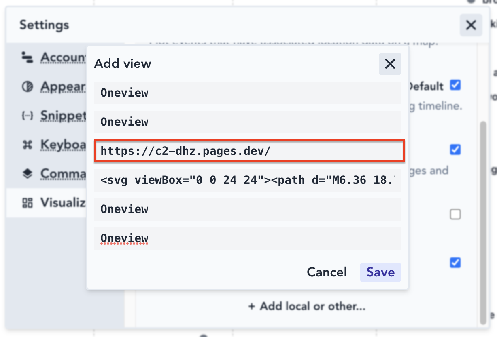

First things first: this repository lacks a license because the code is of dubious ethical standing. It was reverse-engineered from a [Wayback Machine archive from 2019](https://web.archive.org/web/20191003004300/http://app.oneviewcalendar.com/). 

[OneView](https://news.ycombinator.com/item?id=11846108) was posted to hacker news in 2017, and is number 5 on the list of [top scoring Show HN stories that didn't survive](https://nami.land/2023/06/11/track-hn-analyze-survival-rate-of-120-396-show-hn-posts-june-2023.html#top-scoring-show-hn-stories-that-didnt-survive).

I have tried to get in touch with Peter Molyneaux, the creator of OneView, to no avail. If/when he sees this I will do whatever he wants with this repo and the demo site. If he wants it all taken down, fine by me, if he wants it to have a specific license, I'll give it that license, etc. If I don't hear anything from him within a month or two I will assign a permissive license.

This reverse-engineered implementation is made to work as a [markwhen view](https://docs.markwhen.com/visualizations.html), which means that you can add it on [app.markwhen.com](https://app.markwhen.com) via the settings:

If you're running it locally, use `http://localhost:5150`.